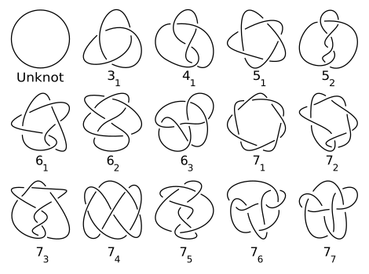

In this first post (in a planned series of 6), I wanted to revisit some of the topics I studied as part of the . For those unfamiliar, a [directed reading program](https://sites.google.com/view/drp-network/) pairs undergraduate students with graduate students to undergo a semester-long supervised study. These programs have some benefits for all parties involved:

- Undergraduates get to learn about math topics that are not covered in core mathematics classes and have a self-guided experience.
- Graduate students can gain valuable teaching experience, reinforce previous knowledge, and practice mathematical communication
- Math departments benefit from increased interaction between graduate and undergraduate populations, contributing to a stronger culture.

My first time participating occurred during the fall of my sophomore year and focused on knot theory under my mentor [Yi Wang](https://yiwang20.web.illinois.edu/). In retrospect, knot theory was a great complement to the topology courses I was taking at the time. At a baseline, knot theory can be easy to understand and explain to even an elementary schooler with a few pieces of string, while fairly difficult when delving into the technical details. My study mainly followed the wonderful, albeit slightly outdated, [The Knot Book](https://search.worldcat.org/title/55633800) by Colin Adams. The book takes a conversational tone, but does a great job of covering the essentials. Let's begin our reflection by defining our titular object of study - knots.

Mathematically, a knot is a continuous map $f: [0, 1] \to \R^{3}$ with $f(0) = f(1)$. This function $f(t)$ parameterizes the path ("string") of the knot. The conditions require that our knot begins and ends in the same point, while our smoothness assumption prevent cusps from appearing or self-intersections. Note that this does not perfectly coincide with our real-world conception of knots; the knot you tie on your shoes are not mathematical knots as the aglets of a shoelace don't connect. Below is a diagram listing some examples of mathematical knots.

Notice that we might be able to draw the same physical knot in two different ways. For example, the "unknot" ($S^{1}$) is the same when we introduce a twist. When we actually draw a knot onto paper (2-D), it could result in different drawings (called a knot presentation). To prevent ambiguity, a knot presentation should not contain any triple "intersections" in the drawing. 

After playing around with knots and their presentations, you can draw quite complicated diagrams that actually represent the same knot. Thus, the natural question arises: Given two knot presentations, how can we tell whether or not they represent the same knot?

First, we need to take a quick detour to define what we mean when we say that two knots are the "same". If we take the strictest definition of equality, then viewing our knots as functions, they clearly aren't equal if they disagree at a point. This isn't very interesting and doesn't coincide with how we've thought of knots up to this point. What we care about is in some sense the "overall shape" of the knot. 

Naturally, as topologists, we might look to defining equivalence by homeomorphism. However, if we care about classifying knots up to homeomorphism, all knots are equivalent!

Theorem 1.1 - All knots are homeomorphic.

Proof: Since being homeomorphic is an equivalence relation, it is sufficient to show that $S^{1}$ and any arbitrary knot $K$ are homeomorphic. Let $f: [0, 1] \to \text{Im} (f)$ and $g: [0, 1] \to S^{1}$.

The above theorem shows that we need to find a weaker notion of homeomorphism.